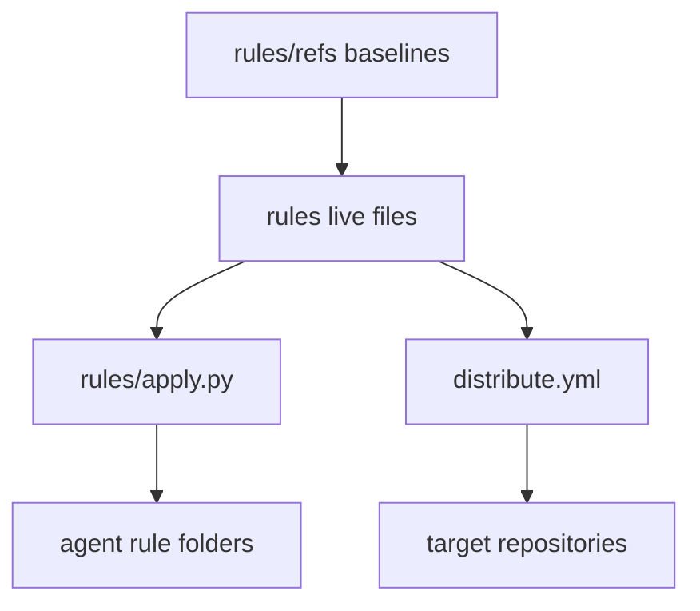

# Clankers

Rules, skills, and workflows for AI agents.

- [rules/](rules/): shared and platform-specific instructions, both ChatGPT fields, and commit rules. See [specification and setup](rules/README.md).
- [skills/](skills/README.md): UI reviews, text compression, and a shared Arena steering/reporting preview. Each skill has `SKILL.md` and supporting files.
- [workflows/](workflows/README.md): portable workflows, currently [init-docs](workflows/init-docs.md) for downstream user and agent docs. The README defines the required format.
- [github/workflows/](github/workflows/README.md): reusable AI GitHub Actions sources, without instruction budgets. The Gemini workflow proposes a version and notes from commit history. A separate approved run creates a tag and draft.
- [automations/](automations/DAILIES.md): recurring prompts, currently combined daily monitoring through ChatGPT scheduled tasks. Each self-contained Markdown prompt runs in one pass and supplies state/evidence rules because runtime state is unreliable.
- [userscripts/](userscripts/README.md): Tampermonkey userscripts for Arena and ChatGPT. Two domain bundles provide saved feature switches. Arena fills the `/agent` composer, opens the `{repo} - Steering` preview, and hides the composer while generating. ChatGPT hides promo and nav elements and clicks Think every second.
- [maintenance/](maintenance/README.md): validation, synchronization, and README measurement tooling, requiring `markdown-it-py` and the npm package `gpt-tokenizer`.
- [rules/refs/](rules/refs/README.md): uncompressed originals and AGENTS.md writing guidelines.
- [skills/refs/](skills/refs/): complete unsquashed source trees for skills with baselines.

`rules/apply.py` copies the global rule files. `apply.bat` runs it on Windows.

## Rules flow

## Instruction budgets

Latest measurements as of 2026-10-10. `maintenance/check.py --update` rebuilds the table and refuses drift. The table covers the arena suite: ARENA.md and every arena-skill file, one row per file, except the proxies. Skill refs stay out.

| File | Measure | Current |
| --- | --- | --- |
| `rules/AGENTS.md` | `o200k_base` | 1,561 `tok` |
| `rules/ARENA.md` | `UTF-8 file size` | 19,494 `B` |
| `rules/CHATGPT-CUSTOM.txt` | `Unicode chars` | 1,499 `chars` |
| `rules/CHATGPT-MORE.txt` | `Unicode chars` | 1,496 `chars` |
| `rules/CLINE.md` | `o200k_base` | 466 `tok` |
| `rules/KILO.md` | `o200k_base` | 88 `tok` |
| `rules/kilo/code.md` | `o200k_base` | 223 `tok` |
| `rules/kilo/debug.md` | `o200k_base` | 270 `tok` |
| `rules/kilo/plan.md` | `o200k_base` | 247 `tok` |
| `rules/COMMIT-SPEC.txt` | `o200k_base` | 93 `tok` |
| `system-prompts/NEMOGPT.md` | `o200k_base` | 3,034 `tok` |
| `skills/amending-violations/SKILL.md` | `o200k_base` | 1,598 `tok` |
| `skills/arena-skill/SKILL.md` | `o200k_base` | 3,733 `tok` |
| `skills/arena-skill/README.md` | `o200k_base` | 1,662 `tok` |
| `skills/arena-skill/references/REFERENCE.md` | `o200k_base` | 2,703 `tok` |
| `skills/arena-skill/assets/app.js` | `UTF-8 file size` | 49,491 `B` |
| `skills/arena-skill/assets/index.html` | `UTF-8 file size` | 7,684 `B` |
| `skills/arena-skill/assets/style.css` | `UTF-8 file size` | 13,367 `B` |
| `skills/arena-skill/scripts/arena-preview` | `UTF-8 file size` | 574 `B` |
| `skills/arena-skill/scripts/install.sh` | `UTF-8 file size` | 14,609 `B` |
| `skills/arena-skill/scripts/preview.py` | `UTF-8 file size` | 121,781 `B` |
| `skills/squash/SKILL.md` | `o200k_base` | 1,389 `tok` |
| `skills/web-interface-guidelines/SKILL.md` | `o200k_base` | 528 `tok` |
| `workflows/init-docs.md` | `o200k_base` | 4,536 `tok` |
| `gpt-plugins/skills/gpt-quirks/SKILL.md` | `o200k_base` | 134 `tok` |
| `gpt-plugins/skills/gpt-handoff/SKILL.md` | `o200k_base` | 1,301 `tok` |
| `gpt-plugins/skills/gpt-planning/SKILL.md` | `o200k_base` | 367 `tok` |
| `gpt-plugins/skills/gpt-github/SKILL.md` | `o200k_base` | 434 `tok` |
| `gpt-plugins/skills/gpt-display/SKILL.md` | `o200k_base` | 9,203 `tok` |

`rules/ARENA.md` and the shipped preview assets and scripts measure by UTF-8 file size, the two ChatGPT fields by Unicode characters, and every other file by `o200k_base` tokens. `maintenance/minify/minify.py` builds the minified files from readable refs, and their recorded sizes are their budgets. Measurements cover complete files, including whitespace and markup.

## Compression

Use the [`squash` skill](skills/squash/SKILL.md) for compression. See [maintenance/README.md](maintenance/README.md) for repository-specific budget and synchronization procedures.
