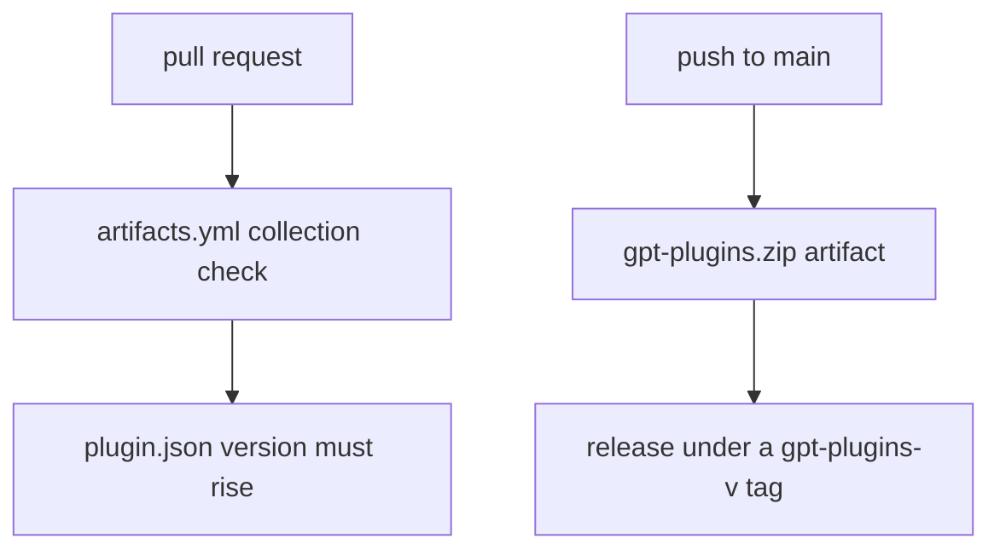

# GPT Plugins

One Agent Plugins 1.0.0 collection for GPT-specific skills. The manifest `plugin.json` owns the plugin metadata and version.

| Path | Purpose |
| --- | --- |
| `plugin.json` | Manifest. The checker checks it against the canonical schema at agent-plugins.org. |
| `skills/<name>/SKILL.md` | Shipped skill copies. The archive carries these. |
| `refs/skills/<name>/SKILL.md` | Readable sources. Keep these full. Compress shipped copies without losing rules. |
| `skills/<name>/references/` | Per-type detail files. A reader loads only the file its answer needs. Both trees stay byte-identical. |
| `README.md` | This file. It never ships. |

## Skills

| Skill | Purpose |
| --- | --- |
| [gpt-quirks](skills/gpt-quirks/SKILL.md) | Apply verified GPT and connected tool quirks when they are relevant |
| [gpt-handoff](skills/gpt-handoff/SKILL.md) | Audit agent work and human-facing docs. Use Ponytail for code and docs audits. Own the final format or draft a handoff. |
| [gpt-planning](skills/gpt-planning/SKILL.md) | Check requirements and completion before each plan, handoff, execution, and final report. |
| [gpt-github](skills/gpt-github/SKILL.md) | Apply the owner's git and GitHub rules to every git or GitHub action. |
| [gpt-display](skills/gpt-display/SKILL.md) | Choose and build a supported response representation: Markdown, DIL components, charts, maps, citations, and Mermaid diagrams. |

## Edit a skill

Skill sources live under `refs/skills/`. Compress shipped copies manually, preserving every rule, condition, exception, command and heading. Review each clause against its source. Increase the plugin version for every update.

See [maintenance/README.md](../maintenance/README.md) for synchronization and validation.

## Package

`.github/workflows/artifacts.yml` checks the collection on pull requests. A pull request that changes shipped plugin files must raise the `plugin.json` version above the base branch. Pushes to `main` write `gpt-plugins.zip` as a direct Actions artifact. On-demand runs package only from `main`.

The `release-gpt-plugins` job in `.github/workflows/artifacts.yml` publishes the same archive as a GitHub Release under the versioned tag `gpt-plugins-v<version>`, taken from `plugin.json`. A tag that exists keeps its release and gets the fresh asset, so the download URL stays stable. The archive carries `plugin.json` and `skills/` only, so `refs/` and this README stay out of it. The workflow fails on a missing or invalid plugin file.
