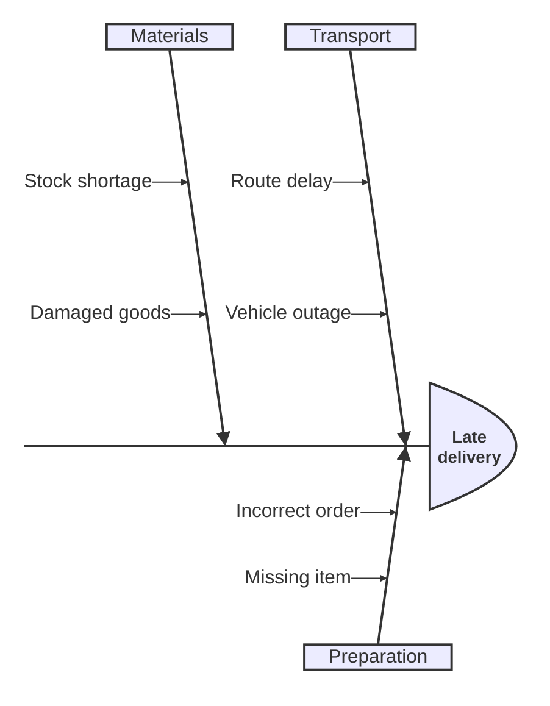

# Ishikawa

Use the first content line after `ishikawa-beta` to name the problem. Use indentation to define causes and sub-causes. Keep observed causes separate from hypotheses.

Do not omit `ishikawa-beta`. This declaration identifies the diagram parser.
