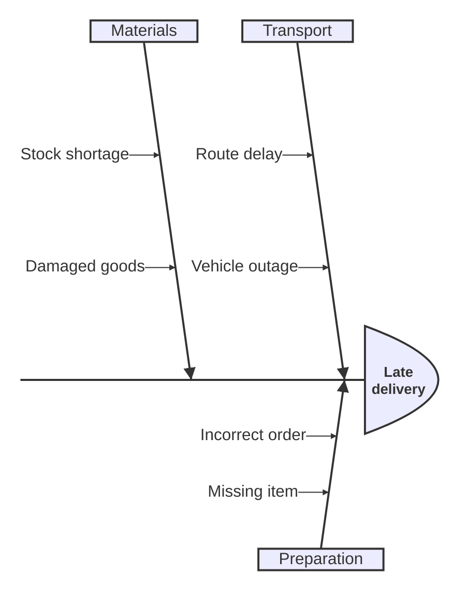

# Ishikawa

```mermaid
ishikawa-beta
  Late delivery
    Transport
      Route delay
      Vehicle outage
    Preparation
      Incorrect order
      Missing item
    Materials
      Stock shortage
      Damaged goods
```

Use the first content line after `ishikawa-beta` to name the problem, and indentation to define causes and sub-causes. Keep observed causes separate from hypotheses.
