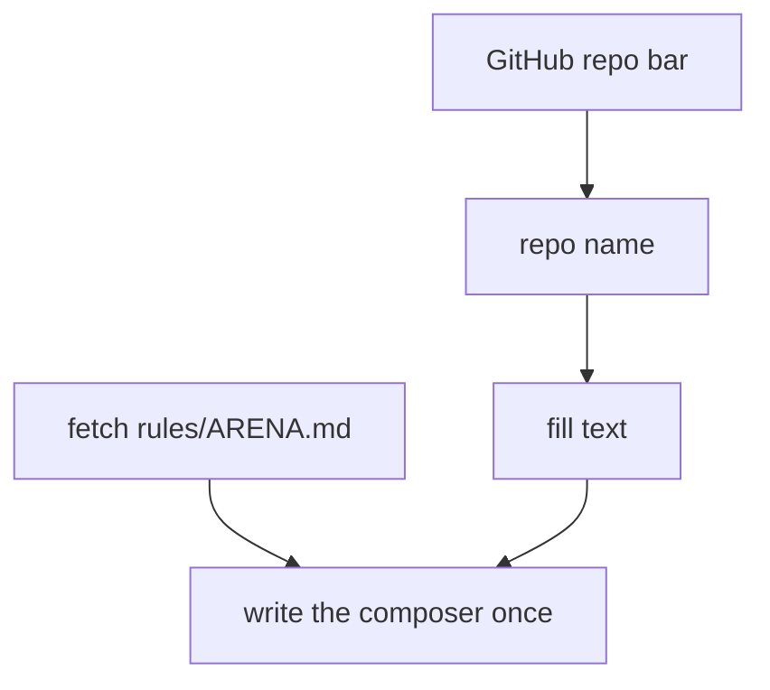

# Userscripts

Tampermonkey userscripts for Arena.ai and chatgpt.com.

| Bundle | Features |
| --- | --- |
| [arena.user.js](arena.user.js) | Prompt fill, Open Steering, Hide composer, Transcript auto-scroll, Transcript trim, Preview state download, Tab title |
| [chatgpt.user.js](chatgpt.user.js) | Hide elements, Auto Think |

## Install

1. Install Tampermonkey in the browser.
2. Open its dashboard and create a new script.
3. Paste one bundle\'s `.user.js` contents and save.
4. Repeat for the other domain if needed.

To migrate, disable or remove the five old scripts before enabling the bundles. Reload open Arena and ChatGPT tabs to stop old timers and observers. Old installations do not become bundles automatically.

Each bundle has its own version and raw GitHub update URL. A saved feature setting belongs to its bundle.

## Feature switches

Eight features default to On. Transcript trim ships OFF because it removes transcript content from the page. On a matching page, open the Tampermonkey menu and select a command such as `Composer — fill (ON)`. The ChatGPT bundle keeps its own `Auto Think: ON — toggle` shape.

Every Arena entry leads with its module, and a switch shows its saved setting in parentheses. One module\'s entries stay together. The modules sit in one order:

1. Composer
2. Proxy
3. Steering
4. Transcript
5. State
6. Page
7. Userscript

Switches apply immediately in the current tab. Other open tabs use saved settings on their next reload. Disabling stops the feature\'s observers, timers and listeners.

The bundles use `GM_getValue` and `GM_setValue` for saved settings, plus menu registration and removal, and they hold no check code. Switches never reload the page. Disabling a hiding feature restores its own DOM changes where the page has not replaced them. Earlier automatic clicks and inserted prompt text remain.

## Console log

Both bundles log under one tag, `[NemoUtils]`. The devtools console filter shows the page\'s story: feature switches on load and on toggle, the prompt fill write, and each state save. A log line never carries a loop, so a busy page stays quiet. No key or message text ever reaches the log.

## Arena Prompt Fill

The feature fills the composer on `/agent` and on `/agent/`, not on paths with a trailing segment.



The message then carries a six-step checklist:

1. Read the task and every file it touches, and trace the flow end to end.
2. Name the requirements and the constraints, and follow the conventions in the code.
3. Take the smallest change that holds: reuse first, one line second, new code last, and add nothing the task does not ask for.
4. Write the failing check before new behavior, and reproduce a bug before the fix.
5. Keep the behavior, interfaces, validation and security that stand.
6. Run the project\'s own gate, and read the result before the report.

Six rules follow the checklist:

- red first for new behavior
- a root-cause fix for a bug, with no repeated failed approach
- stated assumptions
- no claim of an unrun check
- screenshots and corrections through the steering channel, with each image read directly
- a closing report of the change, the checks and the open items

## Arena Transcript Trim

This switch ships OFF, and OFF stops the trim: a reload redraws the transcript from Arena, so removed rows return. On `/agent/*`, ON keeps the newest `50` row nodes across all message roots and removes older rows first. The row limit cannot fall below `20`.

The trim also removes the sibling action container from each message that loses rows or holds no row node. It keeps each message root because Arena crashes if a `#chat-message-*` root leaves its tree.

The menu command reads `Transcript — keep 50 rows`. After a trim it adds the running row count, such as `Transcript — keep 50 rows (12 removed)`. A trim that removes rows also writes one console line.

The command takes one row limit:

- it converts a saved two-value plan to its row limit
- an empty or too small answer keeps the old plan

## Arena Security Check Hold

While the Arena security check shows, the tab title carries the shield emoji and the automatic posts wait. The held work is the prompt fill, the Open Steering click and the proxy key posts. Each tab reads its own page. The held work resumes when the check clears.

## Arena Userscript Pause

One entry, `Userscript — pause all`, stops every feature where it stands: the observers, the timers, the automatic posts and the tab title. The press applies at once, with no reload, and the entry then reads `Userscript — resume all`. The resume brings back every feature whose own switch is ON and leaves the others off.

The script saves the pause, so a reload keeps it. Each feature switch stays in the menu while paused.

## Arena Tab Title

On `/agent/*`, ON reads the repository name from the GitHub link in the session header and sets the tab title to `Arena | <repository>`. While the agent works, the title adds an emoji for the live action, such as `Arena | clankers 🖥️`. The action text is the shimmering status label.

| Mark | Source |
| --- | --- |
| 🖥️ | running, including `Bash` and `command` |
| 📖 | read: `Read` and `Explored` |
| ✏️ | edit: `Edit`, `Editing`, `Editing files`, `Write` and `Writing` |
| 🔍 | search and fetch |
| 💭 | think |
| 💤 | wait, and a row whose command runs the preview poll |
| 💬 | a message whose words grow |
| ❓ | an `ask_user` question card |
| 🛡️ | the security check |
| ⏳ | the model at work with no named action and no streamed words |
| ⚙️ | anything else |

A finished row keeps its shimmer or its pulse in the page, so a row counts only while the stop-generating control is up. That control bounds the row, the words, the waiting line and the process card.

A process card carries a play icon and the process name, so it takes 🖥️ as the newest message of a live turn.

## ChatGPT Hide Elements

On any `chatgpt.com` path, the feature adds `hidden` to eight elements:

- The div that holds the Claim offer button.
- The div that holds the Free offer button.
- The div that holds the Select chat surface toggle.
- The Codex sidebar link.
- The Images sidebar link.
- The Library sidebar link.
- The Free badge.
- The prompt textarea header banner.

A MutationObserver repeats the work when the page changes.

## ChatGPT Auto Think

On any `chatgpt.com` path, the feature clicks the Think pill every second while `aria-pressed` is `false`.

## Check

From the repository root:

```bash
node userscripts/arena.user.js
node userscripts/chatgpt.user.js
node --test maintenance/workflows/userscripts.checks.cjs
node --test maintenance/workflows/userscripts.test.cjs
```

Each command prints `ok` when its checks pass. The bundles carry runtime code only: outside a browser each feature publishes its helpers through `exposeChecks`, and the feature checks run from `maintenance/workflows/userscripts.checks.cjs`. The integration check covers saved switches, reloads, disabled startup, storage errors, transcript growth, forced follow, live cleanup and navigation.
